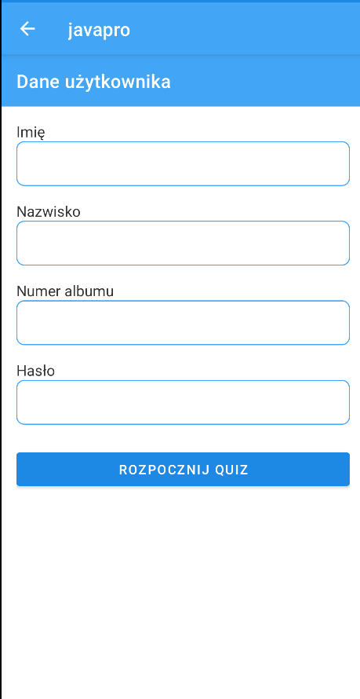

# Projekt Javapro

## Opis

Projekt składa się z dwóch głównych części:

1. **javapro** - RESTowy serwis webowy stworzony przy użyciu Spring Boot. Serwis ten udostępnia API, które może być wykorzystane do różnych zadań związanych z zarządzaniem danymi przez protokół HTTP.
2. **javapromobile** - Aplikacja mobilna stworzona za pomocą Android Studio. Aplikacja ta komunikuje się z serwisem RESTowym `javapro` i umożliwia użytkownikom interakcję z danymi na urządzeniach mobilnych.

## Struktura Projektu

- **javapro**: Katalog zawierający wszystkie pliki źródłowe serwisu RESTowego.
- **javapromobile**: Katalog zawierający wszystkie pliki źródłowe aplikacji mobilnej.

## Dane i Technologie

- **Baza danych**: PostgreSQL - używana do trzymania wszystkich danych aplikacji.
- **ORM**: Hibernate - narzędzie do mapowania obiektowo-relacyjnego, używane do komunikacji aplikacji z bazą danych.

## Moduły Aplikacji Mobilnej

Aplikacja mobilna **javapromobile** zawiera następujące moduły:

1. **Test Java Pro** - Moduł umożliwiający użytkownikom sprawdzenie swojej wiedzy z języka Java poprzez testy i quizy.

2. **Przeglądarka Wykładów** - Sekcja, w której użytkownicy mogą przeglądać dostępne materiały edukacyjne i wykłady.

3. **Czat z ChatGPT** - Funkcjonalność czatu, która pozwala użytkownikom na interakcję z sztuczną inteligencją do prowadzenia rozmów lub zadawania pytań związanych z kursem.

## Wygląd aplikacji:

